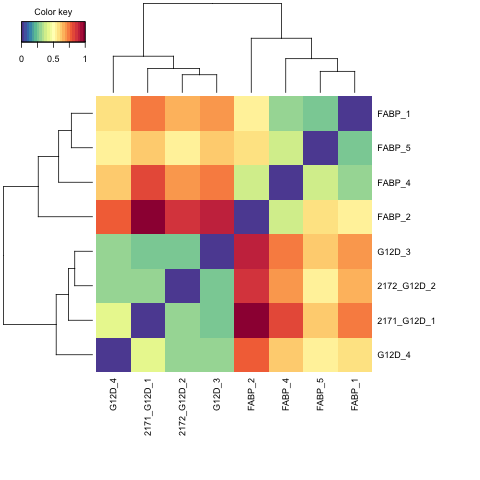
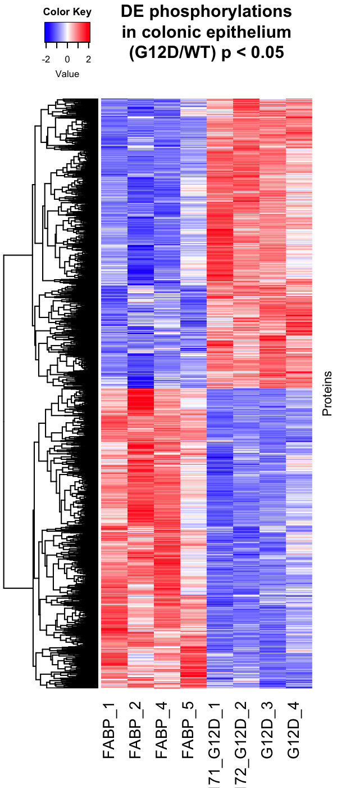

```{r setup, include=FALSE}
knitr::opts_chunk$set(echo = TRUE)
```

## Proteomics dataset 
This is analysis for the phospho-proteomics dataset generated using scraped mouse colon samples (enriched for colonic epithelium) from FAbp-Cre;KRasWT and FAbp-Cre;KRasG12D mice. Emily Poulin harvested the tissue samples and the proteomics were performed by Joao Paulo.

Only normalized values are used to for this analysis.

## Library loading and set up
```{r message=FALSE, warning=FALSE}
options(connectionObserver = NULL)

library(gridExtra)
library(ensembldb)
library(EnsDb.Mmusculus.v79)
library(grid)
library(ggplot2)
library(lattice)
library(reshape)
library(mixOmics)
library(gplots)
library(RColorBrewer)
library(readr)
library(dplyr)
library(VennDiagram)
library(clusterProfiler)
library(DOSE)
library(org.Mm.eg.db)
library(pathview)
library(AnnotationDbi)
library(tidyverse)
library(qdapRegex)
library(gtools)
library(ggfortify)
```

## Load the proteomics dataset and statistical analysis
The original dataset was loaded.
```{r message=FALSE, warning=FALSE}
ce_proteom <- read_csv("2015-03_HaigisMouseColon8plex_Phos.csv", col_types = cols(`Site Position` = "c"))

ce_proteom <- separate(ce_proteom, `Protein Id`, into = c(NA,"Protein_ID",NA), sep = "\\|") 
  
ce_proteom <- ce_proteom %>% mutate(site_ID = paste(ce_proteom$Protein_ID, ce_proteom$`Site Position`, sep = "_"))

```

### Calculate the stats for G12D/WT
```{r}
# establish a new data frame for collecting stats
ce_stats <- ce_proteom[,c(2,3,5,6,19)] 

# Calculate the pvalue using parametric unpaired t test
p_value_list <- c()
for (i in 1:dim(ce_proteom)[1]) {
  p_value <- t.test(unlist(ce_proteom[i,15:18]), unlist(ce_proteom[i,11:14]), paired = FALSE)$p.value
  p_value_list <- c(p_value_list, p_value)
}
ce_stats <- cbind(ce_stats, p_value_list)
colnames(ce_stats)[6] <- "p_values" 

# calculate the q value using Benjamini Hochberg FDR correction
q_value_list <- p.adjust(ce_stats$p_values, method = "BH")
ce_stats <- cbind(ce_stats, q_value_list)
colnames(ce_stats)[7] <- "q_values"

# calculate fold change and log fold change
foldchange_list <- c()
for (i in 1:dim(ce_proteom)[1]) {
  foldchange <- foldchange(mean(unlist(ce_proteom[i,15:18])), mean(unlist(ce_proteom[i,11:14])))
  foldchange_list <- c(foldchange_list, foldchange)
}
logfoldchange_list <- foldchange2logratio(foldchange_list)
ce_stats <- cbind(ce_stats, foldchange_list, logfoldchange_list)
colnames(ce_stats)[8:9] <- c("foldChange", "LFC")
```

Now we output this statistical analysis file into a `csv` file.
```{r}
write.csv(ce_stats, "ceMS_phospho_diff.csv", col.names = NULL)
```

Just to check how many siginificant proteins do we have based on p< 0.05 and q< 0.1
```{r}
sig_dif_stats <- subset(ce_stats, ce_stats$p_values <= 0.05 & ce_stats$q_values <= 0.1)

dim(sig_dif_stats)[1]
```

We have 7569 phosphosites with p < 0.05 and q < 0.1.

## Plot PCA and hierchical clustering
### PCA plot
Since the number of significant changes are quite small, I want to use PCA to check how the samples cluster.
```{r}
df <- ce_proteom[11:18]
df <- as.data.frame(t(df))
df <- cbind(df, c('WT','WT','WT','WT','G12D','G12D','G12D','G12D'))
colnames(df)[14980] <- 'Genotype'
df.set <- as.matrix(df[,1:14979])
df.pca <- prcomp(df.set, center = TRUE, scale = TRUE)
autoplot(df.pca, data = df, colour = 'Genotype') +
  geom_text(aes(label=rownames(df)), vjust = 2, hjust = -0.1) +
  xlim(-0.6, 1.3) + ylim(-0.7, 0.7)
```

### Hierchical clustering
```{r}
pseudoCount = log2(ce_proteom[11:18])

# remove NA, NaN, Inf values from the dataframe
pseudoCount <- na.omit(pseudoCount)
pseudoCount <- pseudoCount[is.finite(rowSums(pseudoCount)),]

mat.dist = pseudoCount
mat.dist = as.matrix(dist(t(mat.dist)))
mat.dist = mat.dist/max(mat.dist)
png('Hierchical_Clustering_Phospho.png')
cim(mat.dist, symkey = FALSE, margins = c(10, 10 ))
suppressMessages(dev.off())
```
Final output is following:


## Plot heatmap, scatterplot, MA plot, and volcano plot
### Heatmap
For heatmap, I will z-score all quantifications across all samples for the same protein. Heatmaps for all phosphosites with p<0.05 are plotted
```{r}
suppressMessages(library(mosaic))

sig_count <- ce_proteom[ce_proteom$site_ID %in% sig_dif_stats$site_ID,]
sig_dif <- cbind(sig_dif_stats, sig_count[,11:18])
for (i in 1:dim(sig_dif)[1]) {
  sig_dif[i,10:17] <- zscore(as.numeric(sig_dif[i,10:17]))
}

my_palette <- colorRampPalette(c("blue", "white", "red"))(256)
heatmap_matrix <- as.matrix(sig_dif[,10:17])

png('G12D vs WT colon ce phospho-proteomics.png',
    width = 600,
    height = 1400,
    res = 200,
    pointsize = 8)
par(cex.main=1.1)
heatmap.2(heatmap_matrix,
          main = "DE phosphorylations\nin colonic epithelium\n(G12D/WT) p < 0.05",
          density.info = "none",
          key = TRUE,
          lwid = c(3,7),
          lhei = c(1,7),
          col=my_palette,
          margins = c(8,2),
          symbreaks = TRUE,
          trace = "none",
          dendrogram = "row",
          labRow = FALSE,
          ylab = "Proteins",
          cexCol = 1.5,
          Colv = "NA")
dev.off()
```
Final output is 

#### Scatter plot, MA plot and Volcano plot for data visualization
```{r}
# Scatter plot
ce_stats$KrasG12D_mean <- rowMeans(log2(ce_proteom[,16:18]))
ce_stats$KrasWT_mean <- rowMeans(log2(ce_proteom[,11:14]))
ggplot(ce_stats, aes(x = KrasWT_mean, y = KrasG12D_mean)) +
  xlab("WT_Average(log2)") + ylab("G12D_Average(log2)") + 
  geom_point(data = ce_stats, alpha = 0.5, size = 1, color = "grey") +
  geom_point(data = subset(ce_stats,ce_stats$p_values < 0.05 & ce_stats$LFC > 0), alpha = 0.5, size = 1, color = "red") +
  geom_point(data = subset(ce_stats,ce_stats$p_values < 0.05 & ce_stats$LFC < 0), alpha = 0.5, size = 1, color = "blue") +
  labs(title = "G12D vs WT Scatter Plot")

# MA plot
ce_stats$'baseMean' <- rowMeans(ce_proteom[,11:18])
ce_stats$'log2baseMean' <- log(ce_stats$`baseMean`,2)
red_subset <- subset(ce_stats,ce_stats$p_values < 0.05 & ce_stats$LFC > 0)
blue_subset <- subset(ce_stats,ce_stats$p_values < 0.05 & ce_stats$LFC < 0)
ggplot(ce_stats, aes(x = `log2baseMean`, y = `LFC`)) +
  xlab("Average Expression") + ylab("LFC") +
  geom_point(data = ce_stats, alpha = 0.5, size = 1, color = "grey") +
  geom_point(data = red_subset, aes(x=`log2baseMean`, y=`LFC`), alpha = 0.5, size = 1, color = "red") +
  geom_point(data = blue_subset, aes(x=`log2baseMean`, y=`LFC`), alpha = 0.5, size = 1, color = "blue") +
  labs(title = "G12D vs WT MA Plot") + ylim(-5,5)

# Volcano Plot
ggplot(ce_stats, aes(x = `LFC`, y = -log(`p_values`,10))) +
  xlab("LFC") + ylab("-log10(P value)") + 
  geom_point(data = ce_stats, alpha = 0.5, size = 1, color = "grey") +
  geom_point(data = red_subset, aes(x=`LFC`, y=-log(`p_values`,10)), alpha = 0.5, size = 1, color = "red") +
  geom_point(data = blue_subset, aes(x=`LFC`, y=-log(`p_values`,10)), alpha = 0.5, size = 1, color = "blue") +
labs(title = "G12D vs WT Volcano Plot") + xlim(-5,5)
```

## SessionInfo
```{r}
sessionInfo()
```